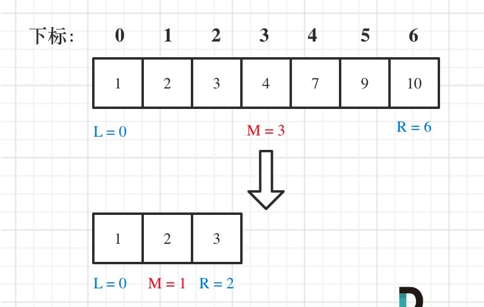
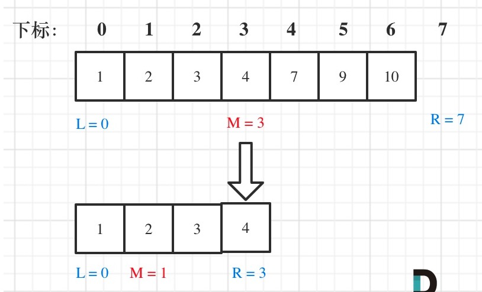

# 思想详解

给一个**有序数组**和目标值，找第一次/最后一次/任何一次出现的索引，如果没有出现返回-1

二分查找一般由三个主要部分组成：

	1. 预处理 —— 如果集合未排序，则进行排序。
 	2. 二分查找 —— 使用循环或递归在每次比较后将查找空间划分为两半。
 	3. 后处理 —— 在剩余空间中确定可行的候选者。

四点要素

- 1、初始化：start=0、end=len-1
- 2、循环退出条件：start + 1 < end
- 3、比较中点和目标值：A[mid] ==、 <、> target
- 4、判断最后两个元素是否符合：A[start]、A[end] ? target

时间复杂度 O(logn)，使用场景一般是**有序数组**的查找

## 第一种策略-[Left,Right]

第一种写法，我们定义 target 是在一个在左闭右闭的区间里，**也就是[left, right]** 

区间的定义这就决定了二分法的代码应该如何写，**因为定义target在[left, right]区间，所以有如下两点：**

- while (left <= right) 要使用 <= ，因为left == right是有意义的，所以使用 <=
- if (nums[middle] > target) right 要赋值为 middle - 1，因为当前这个nums[middle]一定不是target，那么接下来要查找的左区间结束下标位置就是 middle - 1

例如在数组：1,2,3,4,7,9,10中查找元素2。



### 核心

初始条件：left = 0, right = length-1
终止：left >  right 
向左查找：right = mid-1
向右查找：left = mid+1

代码实现：

````java
class Solution {
    public int search(int[] nums, int target) {
        if (nums.length == 0){
            return -1;
        }
        int left = 0;
        int right = nums.length -1;
        while(left <= right){
            int middle = countM(left,right);
            if(nums[middle] == target ){
                return middle;
            }else if(nums[middle] < target) {
                left = middle +1;
            }else {
                right = middle - 1;
            }
        }
        return -1;
    }

    public int countM(int left, int right){
        return left + (right - left ) / 2; // 防止溢出，算除-的数组下标
    }
}
````


## 第二种策略-[Left,Right)

右边为数组的个数而非数组下标时的导致的写法，与第一种写法略有差别在

* while 条件 使用 while（left < right ） left ==  right 时表示已经走出数组边界

* 子迭代中的左区间为 [lef,middle )
* 子迭代的右区间为[middle +1 ,right ) 



代码实现如下

````
````

# leetcode 实践

- [x] [704. 二分查找](https://leetcode-cn.com/problems/binary-search/)

原始的二分查找

````java
class Solution {
    public int search(int[] nums, int target) {
        if (nums.length == 0){
            return -1;
        }
        int left = 0;
        int right = nums.length -1;
        while(left <= right){
            int middle = countM(left,right);
            if(nums[middle] == target ){
                return middle;
            }else if(nums[middle] < target) {
                left = middle +1;
            }else {
                right = middle - 1;
            }
        }
        return -1;
    }

    public int countM(int left, int right){
        return left + (right - left ) / 2;
    }
}
````

- [ ] [69. x 的平方根](https://leetcode-cn.com/problems/sqrtx)

  从一个数的一半开始进行查找

  使用二分查看 middle  * middle 是否等于 x 

  注意溢出，使用除法

  记录middle

````java
class Solution {
    public int mySqrt(int x) {
        if( x == 0){
            return 0 ;
        }
        if(x == 1 ){
            return 1;
        }

        int left = 0;
        int right = x;
        int temp = 0;
        while (left <= right ){
            int middle = left + (right -left ) / 2;	 //二分法
            if(middle <= x / middle){						//防止溢出 使用除法
                left = middle + 1;
                temp = middle;				// 只有小的时候记录 middle
            }else {
                right = middle - 1 ;
            }
        }
        return temp;
    }
}
````

- [x] [374. 猜数字大小](https://leetcode-cn.com/problems/guess-number-higher-or-lower)

直接使用二分进行查找

````java
/** 
 * Forward declaration of guess API.
 * @param  num   your guess
 * @return 	     -1 if num is lower than the guess number
 *			      1 if num is higher than the guess number
 *               otherwise return 0
 * int guess(int num);
 */

public class Solution extends GuessGame {
    public int guessNumber(int n) {

        int left = 1 ; 
        int right = n ;
        while (left <= right){
            int middle = left + ( right - left ) / 2;
            if(guess(middle) == 0){
                return middle;
            }else if(guess(middle) == 1){
                left = middle + 1;
            }else{
                right = middle -1;
            }
        }
    return left;
    }
}
````

- [x] [33. 搜索旋转排序数组](https://leetcode-cn.com/problems/search-in-rotated-sorted-array)

1. 使用二分法查找出数组旋转的下标k
2. 根据数组的0号位的大小确定target 在左段还是右段
3. [使用二分查找在对应的段进行查找]()

````java
class Solution {
    public int search(int[] nums, int target) {
           if (nums== null || nums.length == 0){
                return -1;
            }
            if (nums.length==1) return nums[0] == target ? 0 : -1; 	//处特殊清楚 
            int left = 0;
            int right = nums.length -1;
            int k = 0;
            while (left <= right){
                int middle = left + (right - left) / 2;
                if(nums[middle] < nums[0] && nums[middle-1] >= nums[0]){
                    k = middle;
                    break;
                }else if(nums[middle] < nums[0] && nums[middle-1] < nums[0] ){
                    right = middle - 1;
                }else{
                    left = middle + 1;
                }
            }
            if (k==0 || k == nums.length){	// 数组没有旋转的情况
                return bSerarch(nums,target,0,nums.length -1);
            }

            if (nums[0] > target){	// 数组旋转后进行根据目标值判断在左侧还是右侧
                return bSerarch(nums,target,k,nums.length -1);
            }else{
                return bSerarch(nums,target,0,k-1);
            }
    }
  
  /**
  * 二分查找算法
  */
    public int bSerarch(int[]nums ,int target, int left, int right ){ 
        while (left <= right){
             int middle = left + (right - left) / 2;
            if(nums[middle] < target){
                left = middle +1 ;
            }else if(nums[middle] > target){
                right = middle - 1;
            }else{
                return middle;
            }
        }
        return -1;
    }
}