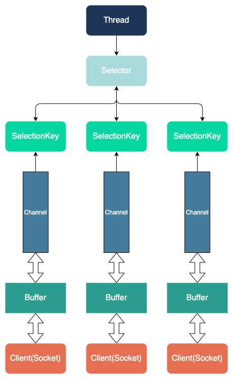

# JDK NIO

## Channel

可以双向进行读写，数据从Channel中读取到Buffer里。也可以从Buffer中写到Channel中。Channel和IO中的Stream(流)是差不多一个等级的。

- 通信通道，每个客户端连接都会建立一个`Channel`通道
- 我的理解是：客户端直接与`Channel`进行通信，当客户端发送消息时，消息就流通到`Channel`里面，本地程序需要将`Channel`里面的数据存放在`Buffer`里面，才可以查看；当本地需要发送消息时，先把消息存在`Buffer`里面，再将`Buffer`里面的数据放入`Channel`，数据就流通到了客户端
- 总而言之：`Buffer`就是本地程序与`Channel`数据交换的一个中间媒介。

### 常用

* **FileChannel**:文件数据的读写,从文件流获取文件Channel。
* **DatagramChannel**: UDP数据的读写。
* **ServerSocketChannel**、**SocketChannel** : 用于TCP数据的读写。

## Buffer

- 缓存数组，就是一个内存块，底层用数组实现
- 与`Channel`进行数据的读写。
- 数据的读取写入是通过`Buffer`, 这个和`BIO` 一样, 而`BIO` 中要么是输入流，或者是输出流, 不能双向，但是`NIO`的`Buffer` 是可以读也可以写, 需要 `flip` 方法切换。

### 常用

* **IntBuffer** 
* **BetyBuffer**:网络中常用的。

### 原理

使用一个数组来存储，然后通过4个值来进行控制读写的状态和当前位置。

| **属性** | **描述**                                                     |
| -------- | ------------------------------------------------------------ |
| Capacity | 容量，即可以容纳的最大数据量；在缓冲区创建时被设定并且不能改变 |
| Limit    | 表示缓冲区的当前终点，不能对缓冲区超过极限的位置进行读写操作。且极限是可以修改的 |
| Position | 位置，下一个要被读或写的元素的索引，每次读写缓冲区数据时都会改变改值，为下次读写作准备 |
| Mark     | 标记 ，一般不会主动修改，在`flip()`被调用后，mark就作废了。  |

## Selector

Selector运行单线程处理多个Channel，如果你的应用打开了多个通道，但每个连接的流量都很低，使用Selector就会很方便。例如在一个聊天服务器中。要使用Selector, 得向Selector注册Channel，然后调用它的select()方法。这个方法会一直阻塞到某个注册的通道有事件就绪。一旦这个方法返回，线程就可以处理这些事件，事件的例子有如新的连接进来、数据接收等。

- NIO之所以是非阻塞的，关键在于它一个线程可以同时处理多个客户端的通信。而`Selector`就是它一个线程如何处理多个客户端通信的关键，一个`Selector`就对应一个线程
- 首先在创建与客户端连接的`Channel`时，应该调用 `Channel.register()`方法，将Channel注册到一个`Selector`上面。调用该方法后，会返回一个`SelectionKey`对象，该对象与`Channel`是一一对应的。而`Selector`则通过管理`SelectionKey`的集合间接的去管理各个`Channel`。

