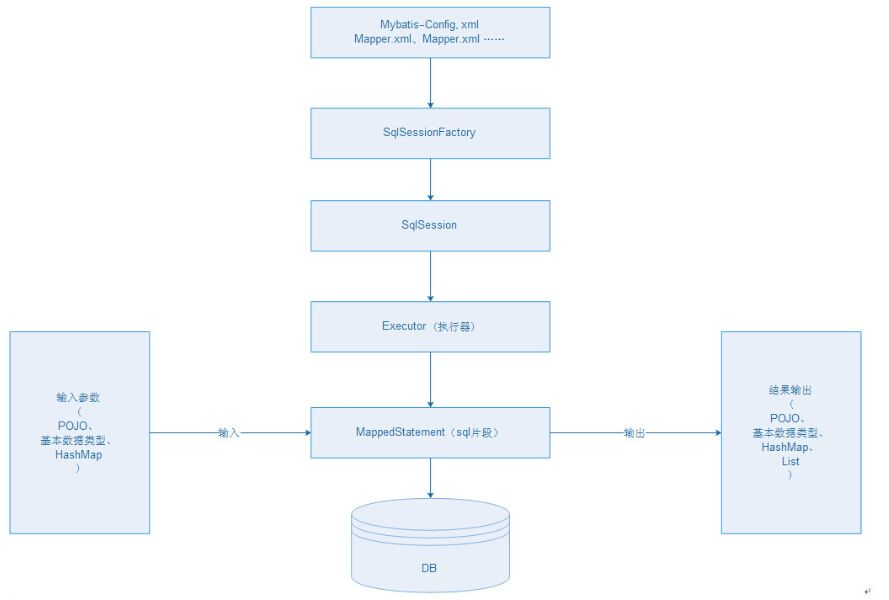

# mybatis简介

## 什么是 MyBatis ？

MyBatis 是一款优秀的持久层框架，它支持定制化 SQL、存储过程以及高级映射。MyBatis 避免了几乎所有的 JDBC 代码和手动设置参数以及获取结果集。MyBatis 可以使用简单的 XML 或注解来配置和映射原生信息，将接口和 Java 的 POJOs(Plain Old Java Objects,普通的 Java对象)映射成数据库中的记录。

1. 全局配置文件
2. 输入映射
3. 输出映射
4. 动态SQL

## 框架结构

## MyBatis 执行过程

1、配置mybatis的配置文件，SqlMapConfig.xml（名称不固定）

2、通过配置文件，加载mybatis运行环境，创建SqlSessionFactory会话工厂(SqlSessionFactory在实际使用时按单例方式)

3、通过SqlSessionFactory创建SqlSession。SqlSession是一个面向用户接口（提供操作数据库方法），实现对象是线程不安全的，建议sqlSession应用场合在方法体内。

4、调用sqlSession的方法去操作数据。如果需要提交事务，需要执行SqlSession的commit()方法。

5、释放资源，关闭SqlSession

###    mybatis 开发dao 的方法

#### 1. 原始方式开发dao

- 需要程序员编写dao接口和实现类
- 需要在dao实现类中注入一个SqlSessionFactory工厂

#### 2. mapper代理开发dao方式

只需要程序员编写mapper接口（就是dao接口）。
程序员在编写mapper.xml(映射文件)和mapper.java（mapper接口）需要遵循一个开发规范：

- mapper.xml中namespace就是mapper.java的类全路径。
- mapper.xml中statement的id和mapper.java中方法名一致。
- mapper.xml中statement的parameterType指定输入参数的类型和mapper.java的方法输入参数类型一致
- mapper.xml中statement的resultType指定输出结果的类型和mapper.java的方法返回值类型一致。

SqlMapConfig.xml配置文件：可以配置properties属性、别名、mapper加载。

##  输入映射

- parameterType：指定输入参数类型可以简单类型、pojo、hashmap。
- 对于综合查询，建议parameterType使用包装的pojo，有利于系统扩展。
- hashmap，#{} 中间的字段就是map中的key

## 输出映射

- resultType：查询到的列名和resultType指定的pojo的属性名一致，才能映射成功。
- reusltMap：可以通过resultMap 完成一些高级映射。如果查询到的列名和映射的pojo的属性名不一致时，通过resultMap设置列名和属性名之间的对应关系（映射关系）。可以完成映射。
  - 高级映射：
    将关联查询的列映射到一个pojo属性中。（一对一）
    将关联查询的列映射到一个List<pojo>中。（一对多)

## 动态SQL

- if判断（掌握）
- where
- foreach
- sql片段（掌握）

 

