# COLA框架探寻

## 框架成员-类之间的关系

### Common

#### DTO

DTo包中主要是一些基础依赖类，用来在RPC的调用中传输，在项目中需要使用RPC传输的可以继承这里的类。

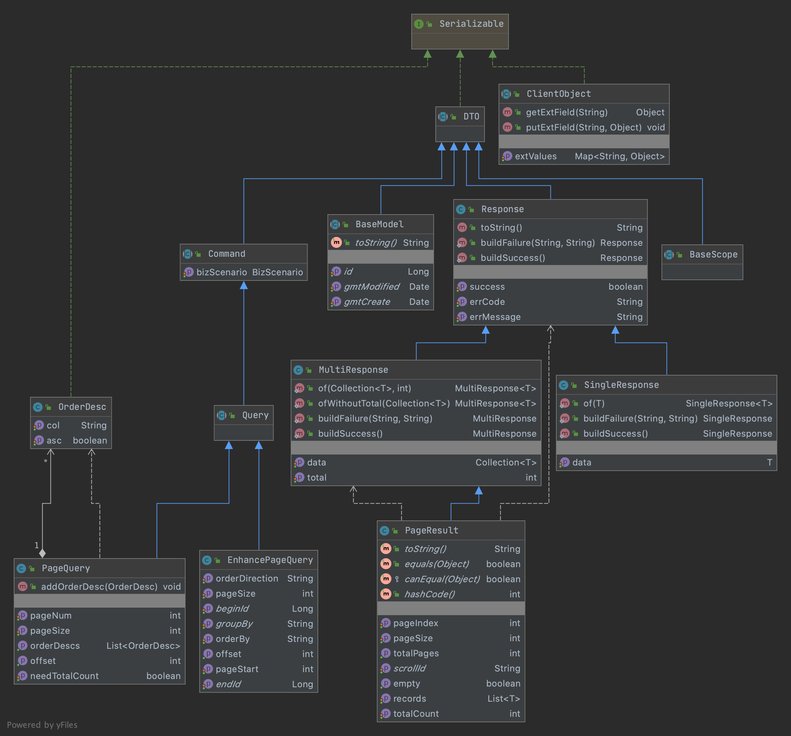

* DTO:标识RPC的类
* BaseModel : 基础模型，认为可以在没有特别业务意义的类上使用
* Command : 命令服务
* Query :查询服务
* Response :基础的服务返回结果类
* MultiResponse : 返回结果是集合类型的
* SingleResponse : 返回结果是单个对象的
* PageResult : 分页返回的

#### Event

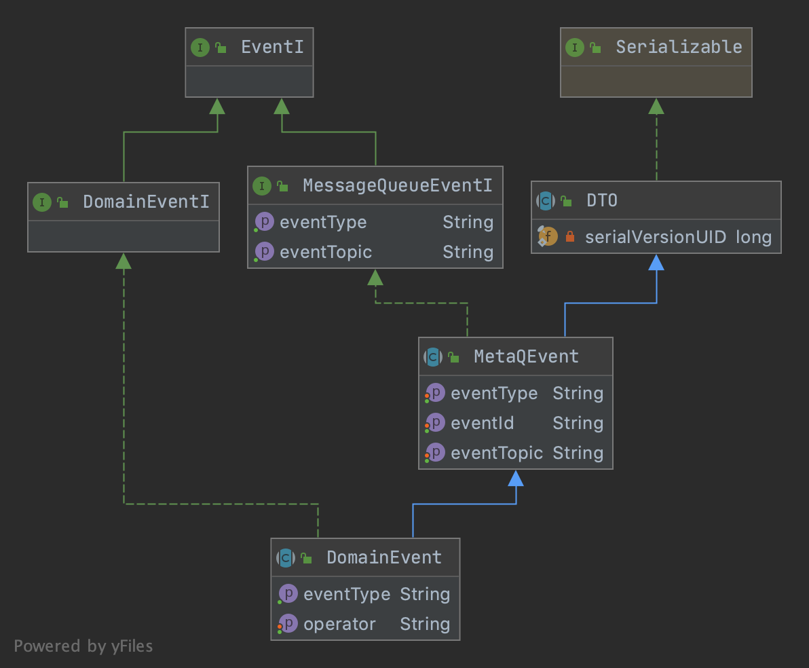

* EventI: 事件的顶层接口
* DomainEventI: 领域事件接口
* MessageQueueEventI：外部消息的事件接口
* DomainEvent：继承外部事件抽象类并拥有领域事件功能的类，包括事件类型和事件操作者
* MetaQEvent: MetaQ事件抽象类

### Core

#### command

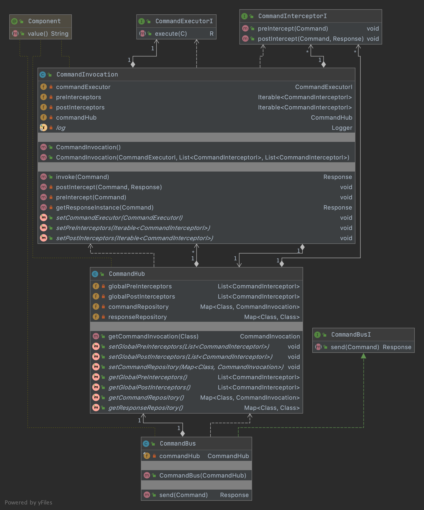

* commandBus: 抽象的，通用调用CommandInvocation的管理器
* CommandHub：注册CommandInvocation，globalPostInterceptors，globalPreInterceptors的中心？或者理解成map
* CommandInvocation：类似一个模板方法，命令执行的抽象流程
* CommandInterceptorI:命令处理器前后的拦截器，类似命令执行前后的AOP操作，在用户侧实现
* CommandExecutorI: 命令处理器接口，他的实现就是变化的，在用户侧实现

#### Boot

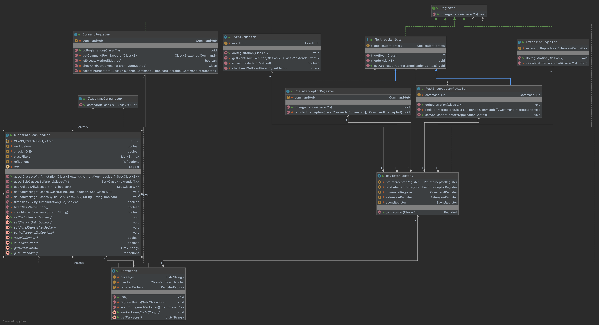 

* Bootstrap： 框架启动类，进行了一些初始化和扫包bean的注册。
* ClassPathScanHandler ： 扫包的工具类
* ClassNameComparator ： 类排序的比较器
* RegisterFactory ： 注册器工厂,可以获取注册器
* RegisterI ： 注册器接口，不同的注册器需要实现不同的注册实现
* AbstractRegister ： 前置和后置拦截器的注册器都用用到的方法的抽象
* PostInterceptorRegister，PreInterceptorRegister： 前置后置拦截器的注册器。
* CommandRegister ： 命令注册器
* EventRegister：事件注册器
* ExtensionRegister ： 拓展点注册器

#### Domain

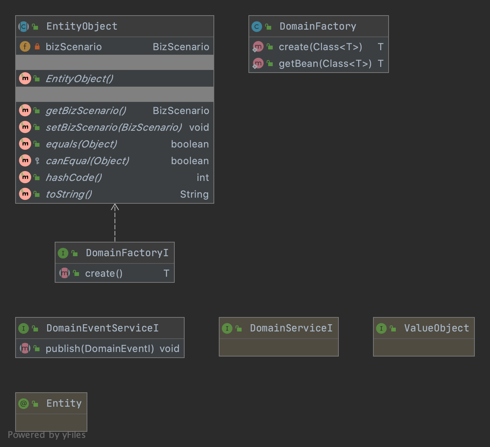

* DomainFactoryI: 领域工厂
* DomainServiceI： 领域服务
* DomainEventServiceI : 领域事件服务，在用户侧自行实现。

#### Event

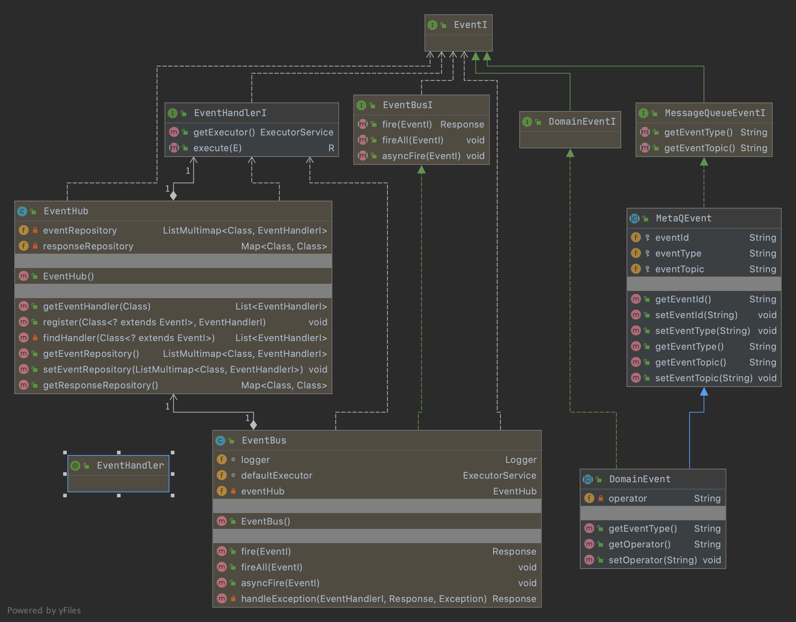

* EventBusI ：事件总线接口
* EventBus ： 事件总线，包含了激发事件的方法
* EventHub ：事件中心，类似上面的命令中心，包含事件的Handler和注册的方法
* EventHandlerI ： 事件处理接口，需要在用户侧实现

#### Extension

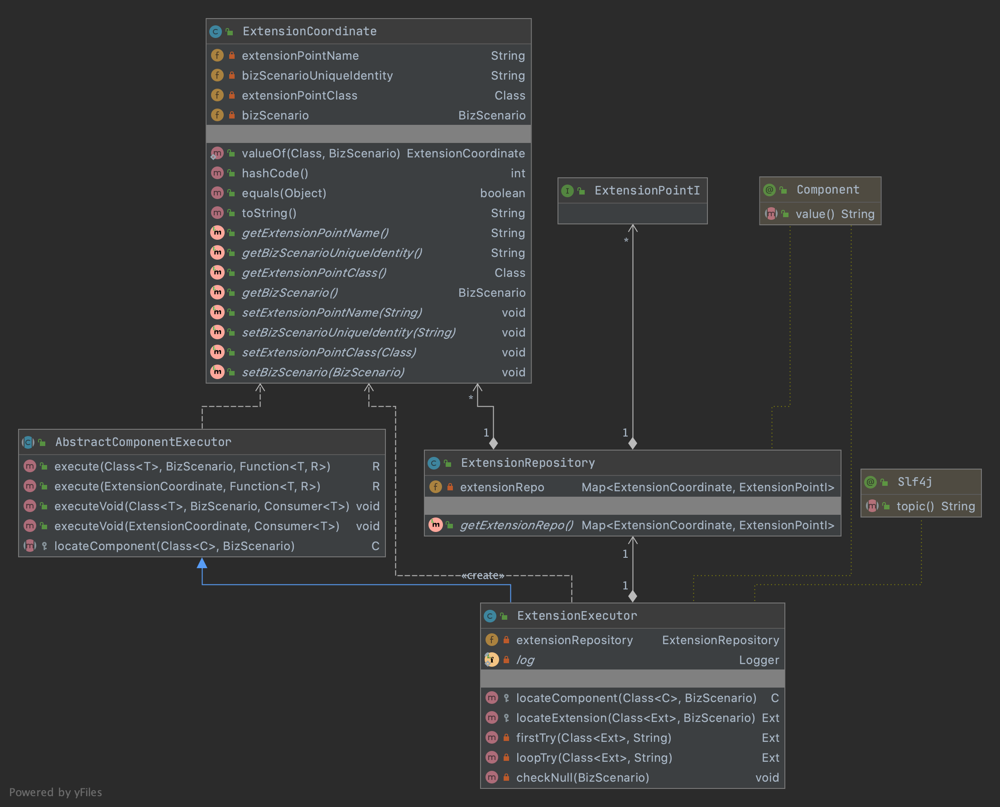

* AbstractComponentExecutor ： 抽象的拓展点的执行器，包含了抽象的execute方法
* ExtensionExecutor：拓展点执行器，可以定位拓展点，在用户侧调用，三个流程
* ExtensionRepository ： ExtensionCoordinate(拓展点坐标)的仓库 （map）
* ExtensionCoordinate : 拓展点坐标 三个指标 还有拓展点
* ExtensionPointI ：扩展点表示一块逻辑在不同的业务有不同的实现，使用扩展点做接口申明，然后用Extension（扩展）去实现扩展点。 

#### Repository

* RepositoryI : 数据仓库接口，屏蔽起来具体的数据源或者数据通道

---

## 调用流程

#### 调用大图


#### 初始化流程

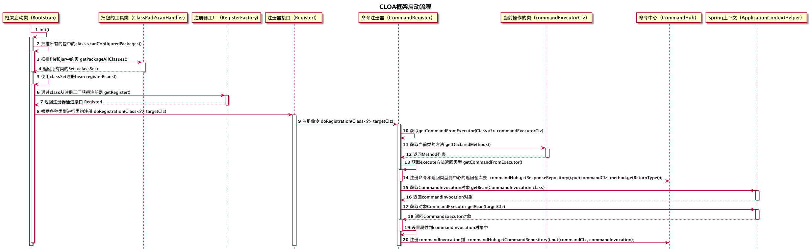

1. 首先通过init进行初始化

2. 调用scanConfiguredPackages()去扫描包下所有的class

3. 去调用getPackageAllClasses()根据file类型和jar类型分别读取class

   主要关注这几行代码

   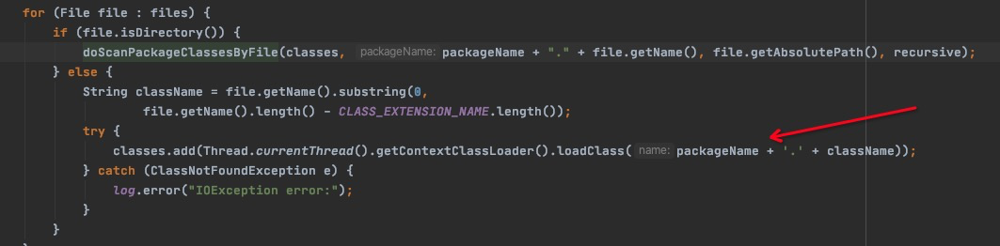

4. 获取到类的set后，调用registerBeans 通过注册器工厂获取注册器，这里是通过获取类的注解，然后进行判断是哪个类型，返回哪个哪类型的注册器，关注这几行

   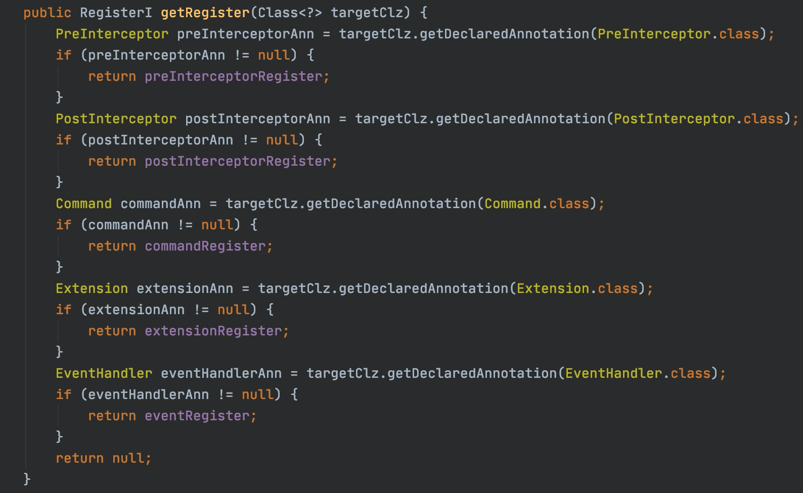

5. 获取到注册器之后，通过类型在运行时绑定的类型，去执行具体的注册方法，具体操作就是调用doRegistration()方法。这里需要关注的是注册器的doRegistration()方法对应的targetclz 和注册的关系
   1. CommandRegister :  **CommandExecutorI**  , **<Class /*CommandClz*/, CommandInvocation>**
   2. ExtensionRegister :  **ExtensionPointI** , **<ExtensionCoordinate, ExtensionPointI>**
   3. eventRegister : **EventHandlerI** ,  **<Class /* EventIClz*/, EventHandlerI>**
   4.  preInterceptorRegister :  **CommandInterceptorI**  ，**List<CommandInterceptorI>** 
   5. postInterceptorRegister :   **CommandInterceptorI**，**List<CommandInterceptorI>**
6. 这里以CommandRegister命令注册器为例介绍一下是如何加载对象到对应的Hub中去
7. 
   1. CommandRegister的注册流程是先获取execute方法的返回值类型，然后把返回值类型注册到hub的返回值仓库中去
   2. 然后获取了CommandInvocation，设置了CommandInvocation对应的CommandExecutor和拦截器
   3. 然后把CommandInvocation放入到hub的CommandRepository仓库中具体关注这几行

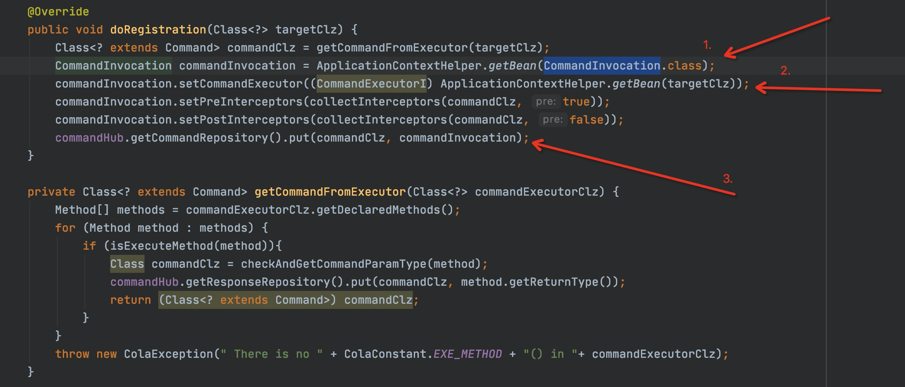

剩下还有EventRegister,ExtensionRegister,PostInterceptorRegister,PreInterceptorRegister分别实现了不同的注册方法，不过都是通过ApplicationContextHelper来获取bean，不同的注册器有各自对应需要注册的对象，必读EventHandlerI，ExtensionPointI，等等，大家感兴趣可以去看看各自不同类型的实现。

#### 事件调用流程

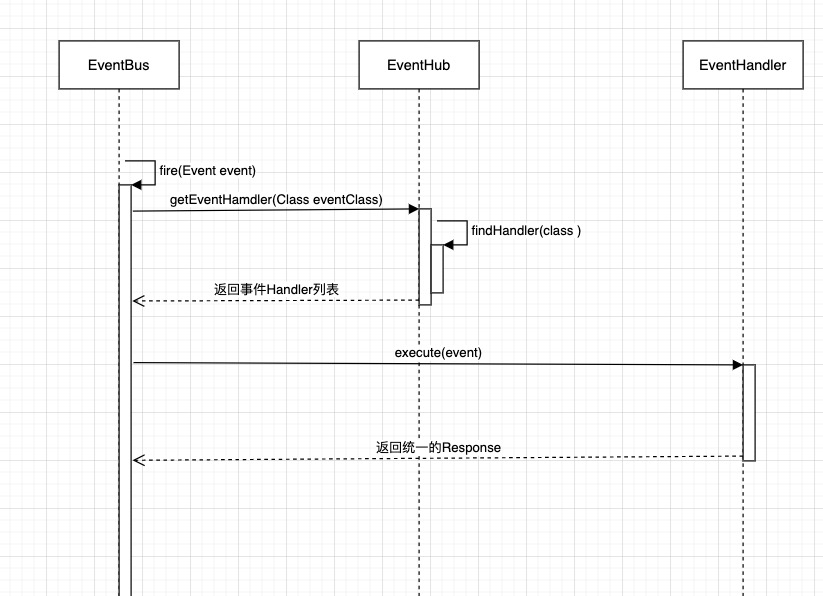

1. 事件的调用流程比较简单，是在业务中通过事件总线去调用fire()，激发事件处理器去触发事件
2. fire通过事件中心EventHub中的eventRepository根据事件的class获取事件的Handler
3. 拿到eventHandler之后通过接口调用execu，进行执行然后获取结果返回

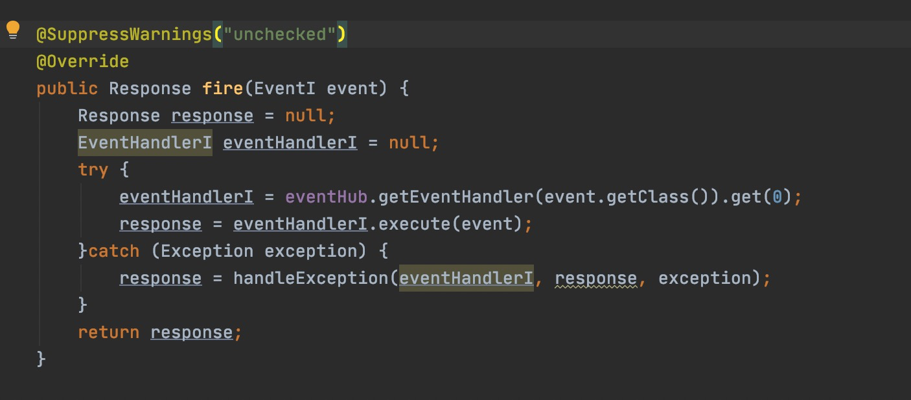

这个部分的流程很简单，但是他灵活和解耦的部分主要在于事件和事件Handler的对应上，在业务实现部分可以完全不用关心技术实现的细节，也很方便后期修改和升级。所以问题就到了自己编写事件和事件Handler上，还有一个就是事件和事件Handler的注册。

这里有一个简单的例子

````java
//Event
@Data
@AllArgsConstructor
public class TestEvent extends DomainEvent {
    private String event ;

    public TestEvent() {
        event = "这是一个事件";
    }
}

//EventHandler
@EventHandler
public class TestEventHandler implements EventHandlerI<Response ,TestEvent> {


    @Override
    public Response execute(TestEvent testEvent) {
        System.out.printf(testEvent.getEvent()+"处理了");
        return null;
    }
}

//InvokeTest
@RunWith(SpringRunner.class)
@ContextConfiguration(classes = {TestConfig.class})
public class TestEventTest {

    @Autowired
    EventBus eventBus;


    @Test
    public void testEventHander(){
      ...
     eventBus.fire(new TestEvent());
    }
}


//out
这是一个事件处理了

````

#### 命令调用流程

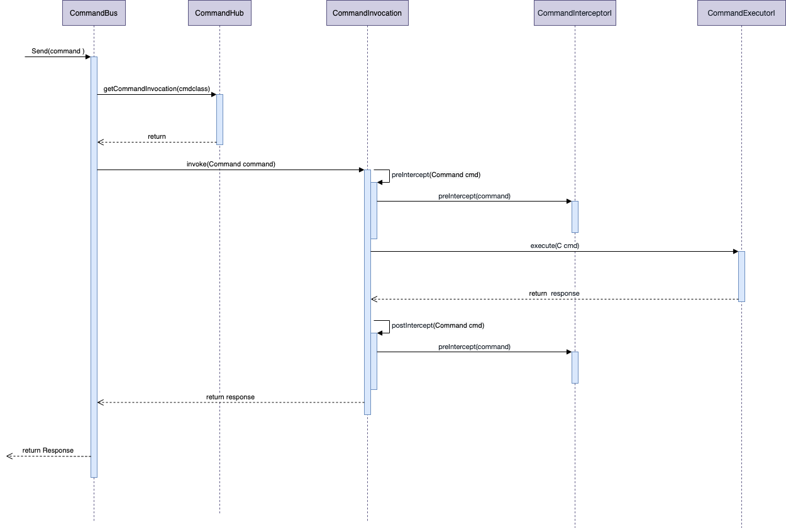

1. 命令模式的的调用和实现和事件比较类似，不过它有一个CommandInvocation实现的模板方法
2. 当调用send方法向命令总线发送命令的时候
3. 命令总线去CommandHub中的commandRepository中根据命令去查询对应的CommandInvocation
4. 获取到commandInvocation之后执行commandInvocation.invoke()方法
5. Invoke()方法先获取了所有的前置拦截器进行执行，然后执行了用户自己实现的CommandExecutor.execute()方法
6. 然后获取后置拦截器，执行用户实现的拦截器方法

#### 拓展点调用流程

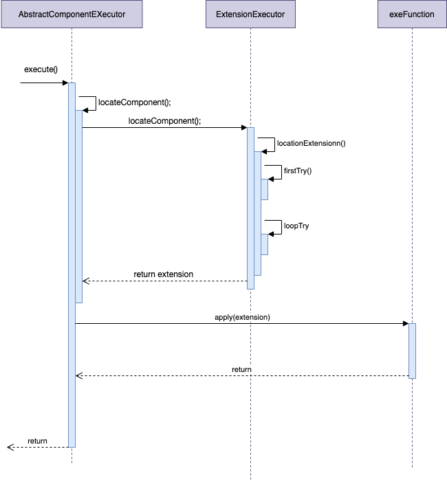

1. 实现了根据业务种类实现了不同的拓展点，然后在需要进行拓展的地方调用AbstractComponentExecutor.execute(Class<T> targetClz, BizScenario bizScenario, Function<T, R> exeFunction)方法

   * 第一个参数是拓展点的class
   * 第二个是业务表示的坐标BizScenario
   * 第三个是需要在拓展点进行的拓展操作，以Lambda 表达式的方式传入
   
2. 框架主要是根据在exexute方法中设置的BizScenario坐标进行了查询对应的拓展点实现，具体参考三个点

   1. **业务（Business）**：就是一个自负盈亏的财务主体，比如tmall、淘宝和零售通就是三个不同的业务。
   2. **用例（Use Case）**：描述了用户和系统之间的互动，每个用例提供了一个或多个场景。比如，支付订单就是一个典型的用例。
   3. **场景（Scenario）**：场景也被称为用例的实例（Instance），包括用例所有的可能情况（正常的和异常的）。比如对于“订单支付”这个用例，就有“可以使用花呗”，“支付宝余额不足”，“银行账户余额不足”等多个场景。

3. 首先直接根据三个维度获取，找不到的时候，拆开来一个点一个点的进行查找，找到对应的拓展点之后执行拓展方法。

这里有一个简单的例子

````java
//拓展点接口
public interface TestExtPt extends ExtensionPointI {

    public String doExtensionAction(String Par);
}

//两个业务场景
@Data
@Extension(bizId = Constants.BIZ_1)
public class TestOneExtPiont implements TestExtPt {

    private BizScenario bizScenario;

    @Override
    public String doExtensionAction(String Par) {
        System.out.println(Par+"noe");
        return null;
    }
}

@Extension(bizId = Constants.BIZ_2)
public class TestTwoExtPiont implements TestExtPt {
    @Override
    public String doExtensionAction(String Par) {
        System.out.println(Par+"two");
        return null;
    }
}

//执行拓展的方法
  public void doexecutor(BizScenario bizScenario,String par){
        extensionExecutor.execute(TestExtPt.class,bizScenario, extension -> extension.doExtensionAction(par));
 }

//需要拓展的位置
@RunWith(SpringRunner.class)
@ContextConfiguration(classes = {TestConfig.class})
public class TestExtTest {
    @Autowired
    private ExtensionExecutor extensionExecutor;

    private BizScenario bizScenario ;


    @Test
    public void dotest(){
       bizScenario = BizScenario.valueOf(Constants.BIZ_1);
       String par1 =  "这是第一种类型调用";
       doexecutor(bizScenario,par1);

       String par2 =  "这是第二种类型调用";
       bizScenario = BizScenario.valueOf(Constants.BIZ_2);
        doexecutor(bizScenario,par2);
    }
}
````


----


## 思想学习

### 依赖倒置

依赖倒置在CLOA中一个显著的实现就是在Domain层和Infrastructure之间增加Gateway。


在Domain层进行Gateway的定义，在Infrastructure进行实现，这就实践了依赖倒置的原则 。

### 业务逻辑和技术实现的分离

我们在Domain层中实现业务逻辑，在Domain层使用抽象的技术接口来进行实现逻辑，外层的技术细节来实现这些接口以便修改。


