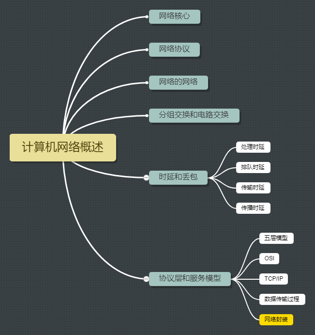
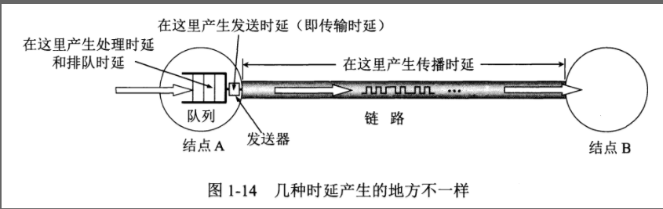
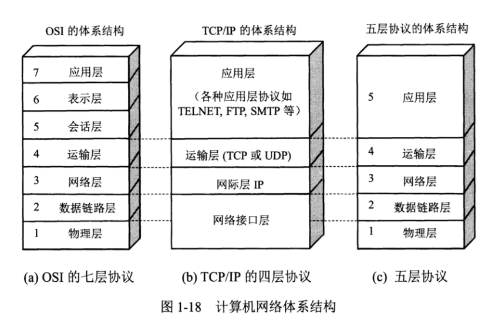
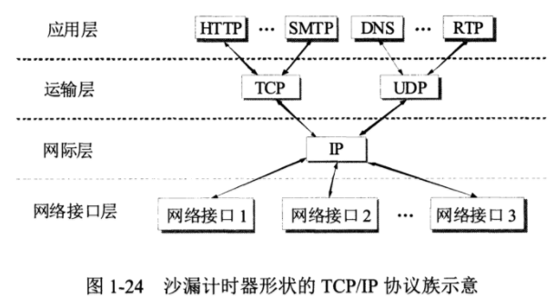

[TOC]

# 一、概述

## 计算机网络

 

由全球范围内的计算机设备和各种非传统的设备（智能手机、平板电脑、电视、游戏机、web相机、汽车、各种传感器）和安全系统以及各种中转设备以及链路组成的系统。由主机或者端系统互相连接起来的系统，2011年估计因特网的用户超过了20亿。

## 内容结构

## 网络核心

由互联因特网端系统的分组交换机和链路构成的网状网络，途中加粗阴影线勾画的部分。

## 网络的网络

网络把主机连接起来，而互联网是把多种不同的网络连接起来，因此互联网是网络的网络。

## 分组交换和电路交换

### 1. 分组交换

每个分组都有首部和尾部，包含了源地址和目的地址等控制信息，在同一个传输线路上同时传输多个分组互相不会影响，因此在同一条传输线路上允许同时传输多个分组，也就是说分组交换不需要占用传输线路。

在一个邮局通信系统中，邮局收到一份邮件之后，先存储下来，然后把相同目的地的邮件一起转发到下一个目的地，这个过程就是存储转发过程，分组交换也使用了存储转发过程，可能会出现丢包或者排队延迟。

### 2. 电路交换

预留的端系统通信沿路所需要的资源，电路交换用于电话通信系统，两个用户要通信之前需要建立一条专用的物理链路，并且在整个通信过程中始终占用该链路。由于通信的过程中不可能一直在使用传输线路，因此电路交换对线路的利用率很低，往往不到 10%。

## 网络协议

计算机网络中的组件都是通过协议来进行交互数据的，一个协议定义了在两个或者多个通信实体之间交换保温或者其他事件所采取的的动作。

## 时延和丢包

总时延 = 传输时延 + 传播时延 + 处理时延 + 排队时延

### 1. 传输时延

主机或路由器传输数据帧所需要的时间。

  

其中 l 表示数据帧的长度，v 表示传输速率。

### 2. 传播时延

电磁波在信道中传播所需要花费的时间，电磁波传播的速度接近光速。

  

其中 l 表示信道长度，v 表示电磁波在信道上的传播速度。

### 3. 处理时延

主机或路由器收到分组时进行处理所需要的时间，例如分析首部、从分组中提取数据、进行差错检验或查找适当的路由等。

### 4. 排队时延

分组在路由器的输入队列和输出队列中排队等待的时间，取决于网络当前的通信量。

### 丢包

链路的的带宽是有限的，一条链路前的路由器的队列容量也有限，如果流量强度接近1，排队时延将接近无限大，新达到的分组就会被丢弃。

## 协议层和服务模型

计算机网络有几种模型，都是分层结构，每一层都像上层提供服务。

### 1. 五层协议

- **应用层** ：为特定应用程序提供数据传输服务，例如 HTTP（Web文档的请求和传送）、DNS（域名系统）、SMTP（电子邮件报文的传输），FTP（两个端系统的文件传输） 等。数据单位为报文。
- **运输层** ：提供的是进程间的通用数据传输服务。由于应用层协议很多，定义通用的运输层协议就可以支持不断增多的应用层协议。运输层包括两种协议：传输控制协议 TCP，提供面向连接、可靠的数据传输服务，数据单位为报文段；用户数据报协议 UDP，提供无连接、尽最大努力的数据传输服务，数据单位为用户数据报。TCP 主要提供可靠完整性服务，UDP 主要提供及时性服务。
- **网络层** ：为主机间提供数据传输服务，而运输层协议是为主机中的进程提供服务。网络层把运输层传递下来的报文段或者用户数据报封装成分组，传输的单位是数据报。
- **数据链路层** ：网络层针对的还是主机之间的数据传输服务，而主机之间可以有很多链路，链路层协议就是为同一链路的主机提供服务。数据链路层把网络层传下来的分组封装成帧。
- **物理层** ：考虑的是怎样在传输媒体上传输数据比特流，而不是指具体的传输媒体。物理层的作用是尽可能屏蔽传输媒体和通信手段的差异，使数据链路层感觉不到这些差异。

### 2. OSI模型
其中表示层和会话层用途如下：

- **表示层** ：数据压缩、加密以及数据描述，这使得应用程序不必担心在各台主机中数据内部格式不同的问题。
- **会话层** ：建立及管理会话。

五层协议没有表示层和会话层，而是将这些功能留给应用程序开发者处理。

### 3. TCP/IP 四层

它只有四层，相当于五层协议中数据链路层和物理层合并为网络接口层。

TCP/IP 体系结构不严格遵循 OSI 分层概念，应用层可能会直接使用 IP 层或者网络接口层。

TCP/IP 协议族是一种沙漏形状，中间小两边大，IP 协议在其中占用举足轻重的地位。

### 4.数据的传输过程和封装

在向下的过程中，需要添加下层协议所需要的首部或者尾部，而在向上的过程中不断拆开首部和尾部。

在发送端，应用层报文到运输层，加上附加信息封装成运输层报文段，然后网络层在将其封装成数据报，然后链路层创建链路层帧。接收端则相反。

路由器只有下面三层协议，因为路由器位于网络核心中，不需要为进程或者应用程序提供服务，因此也就不需要运输层和应用层。